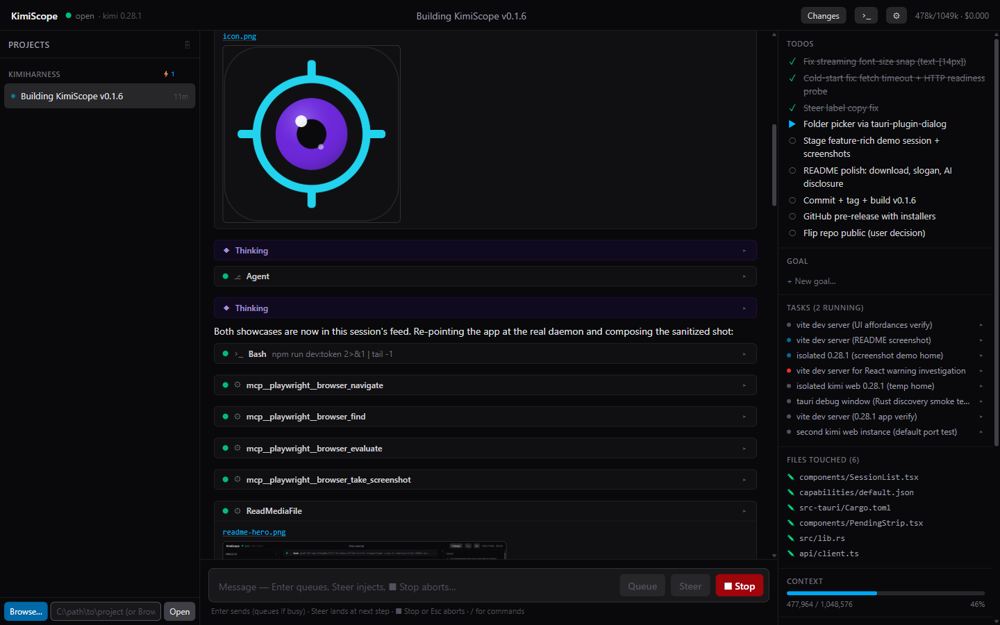

# KimiScope

**A window into Kimi, built by Kimi.**

KimiScope is a standalone desktop app for [Kimi Code](https://www.kimi.com/code) — a rich, reliable UI on top of the kimi daemon's local REST + WebSocket API. Sessions live in the daemon; the window is a disposable renderer.



- **Live streaming** with collapsible thinking blocks and inline image results (with source-file links)
- **Tool cards**: terminal-style Bash, diffs for edits, nested subagent panels
- **Insight rail**: todos, context/token usage, background tasks, goals, files touched, clickable session config (model / thinking / permission mode / plan)
- **Approvals & questions** in the UI (works with yolo/auto/manual)
- Queue / steer / stop control of running turns, per-session composer drafts, queued-prompt editing
- **Multi-project sidebar** with turn vs background activity indicators (⚡ mid-turn, ⟳ background tasks), rename/fork/export per session
- Local terminal pane, session diffs, crash-proof resync

## Install

**Requirements:** Windows, [Node.js](https://nodejs.org), and the [Kimi Code CLI](https://www.kimi.com/code) (`npm install -g @moonshot-ai/kimi-code`, then `kimi login` once). Verified against kimi 0.27.0 and 0.28.1 — later versions are untested until verified (the daemon API is model-agnostic; any Kimi model the CLI supports renders fine).

**Download the installer from [Releases](../../releases)** (MSI or NSIS `KimiScope_*_setup.exe`) and run it. KimiScope auto-starts the local kimi server (`kimi web`) and reads its token — no further wiring.

> Beta notes: Windows only for now, and no auto-update — new versions are a manual reinstall from Releases.

## Optional agent powers (MCP)

Configured in `~/.kimi-code/mcp.json` (toggleable in Settings ⚙). Example:

```json
{
  "mcpServers": {
    "playwright": { "command": "npx", "args": ["-y", "@playwright/mcp@latest", "--browser", "chromium"] },
    "memory": { "command": "npx", "args": ["-y", "@modelcontextprotocol/server-memory"] },
    "windows": {
      "command": "uvx",
      "args": ["windows-mcp", "serve", "--transport", "stdio", "--tools",
               "Snapshot,Screenshot,Click,Type,Scroll,Move,Shortcut,Wait,WaitFor,App,Clipboard,Notification,MultiSelect"]
    }
  }
}
```

- Everything above self-downloads on first use.
- Restart the daemon after editing `mcp.json` (Settings ⚙ restart button).
- Caution: yolo permission mode auto-approves MCP tool calls. Keep GUI-control servers scoped like the example above.

## Built by Kimi, for Kimi

KimiScope is itself a Kimi Code project. The architecture, protocol probing, implementation, tests, docs, and release engineering were driven by a Kimi agent working through the same daemon API the app renders — with human direction and review at every step. The feature list is equally dogfooded: the inline image results, background-task visibility, and presence indicators all came from real Kimi sessions asking for a better window into their own work.

If you're evaluating Kimi Code, this repo doubles as a live sample of what a session can carry end-to-end.

## Dev

```sh
npm run dev                                # terminal 1 (vite)
cd src-tauri && cargo run --no-default-features   # terminal 2 (app window)
```

Or in a plain browser (no Tauri window, e.g. for Playwright): `npm run dev:token` once, `npm run dev`, open http://localhost:5173.

Build: `npm run tauri build` (kill any running KimiScope.exe first — Windows locks it).
Requires Rust + Node. Architecture, protocol facts, and pitfalls: `AGENTS.md`.

## License

MIT
